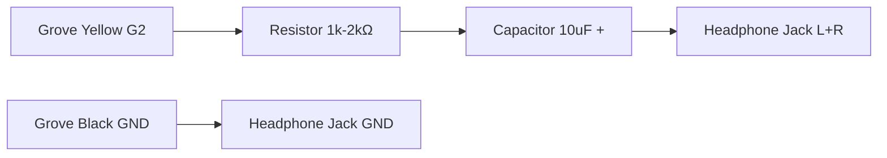

我在gemini的辅助下完成了这个程序。

---
# M5-RTS or M5 Radio Time Simulator

### 📻 M5电波表授时器, as Global Radio Clock Sync Tool

**M5-RTS** is a portable, multi-protocol Radio Controlled Clock (RCC) signal simulator based on **M5Stack Cardputer**. It allows you to sync your Casio, Citizen, Seiko, and other radio-controlled watches anywhere in the world, even without a real radio signal.

**M5-RTS** 是一个基于 **M5Stack Cardputer** 的便携式多协议电波表信号模拟器。它可以模拟全球主流的电波授时信号，帮助你在无信号覆盖区域或室内深处校准你的卡西欧、西铁城、精工等电波手表。

---

## ✨ Features / 功能特性

* **==🌍 Multi-Protocol Support / 全球协议支持==**:
* **BPC (China 68.5kHz)**: Optimized 12H format logic for better compatibility with older movements. (兼容老款机芯的12小时制优化)
* **JJY (Japan 40kHz/60kHz)**: Full packet support including Year, Month, Day, Day of Year (DOY), Weekday. (完整日期支持)
* **WWVB (USA 60kHz)**: Supports DST, Leap Year, and DOY logic. (支持夏令时和闰年)
* **MSF (UK) / DCF77 (Germany)**: Basic signal generation.


* **🔊 Triple Output Modes / 三模输出驱动**:
* **SPEAKER**: Internal speaker for close-range syncing. (内置喇叭近场对时)
* **HEADPHONE**: Low-voltage PWM for audio jack adapters (Hearing protection). (耳机模式，低电平保护听力)
* **COIL (BOOST)**: High-power PWM for driving external DIY coil antennas. (线圈模式，满功率驱动)


* **📶 Smart Connectivity / 智能连接**:
* Auto-connects to saved WiFi on boot. (开机自动重连)
* Interactive **WiFi Scanner & Password Wizard** if connection fails. (连接失败自动进入扫描向导)
* NTP Time Sync with timeout skip. (NTP 网络对时)


* **🌐 Global Roaming / 全球漫游**:
* Adjustable timezone (0.5h steps) for regions like India/Australia. (支持0.5小时时区步进)
* "Spoofing Mode": Send Beijing time using JJY protocol. (支持用 JJY 协议发北京时间)


---

## 🛠️ Hardware Setup / 硬件扩展

This project utilizes the **Grove Port A** (Red port on the left) for external signal output.
本项目利用 Cardputer 左侧红色的 **Grove 接口 (Port A)** 进行信号扩展。

### Pin Definition / 引脚定义

* **G2 (Yellow)**: PWM Signal / 信号输出
* **GND (Black)**: Ground / 地线
* **5V (Red)**: VCC / 电源 (Only for Coil / 仅限线圈模式)

### 🎧 Mode 1: Headphone Adapter (Audio Jack) / 耳机转接头

*Use this to listen to the signal or sync via headphones.*
*用于监听信号或通过耳机贴合手表对时。*

**⚠️ WARNING:** Do NOT connect headphones directly! You MUST use a resistor and capacitor.
**⚠️ 警告:** 严禁将耳机直接接在 Grove 口！必须串联电阻和电容，否则可能烧毁耳机。



### 🌀 Mode 2: LF Coil Antenna (Long Range) / 低频线圈天线

*Best performance for syncing watches wirelessly (10-30cm range).*
*效果最好的方案，可实现 10-30cm 无线对时。*

**⚠️ WARNING:** Do NOT connect the coil directly to G2! A driver circuit is required.
**⚠️ 警告:** 严禁将线圈直接接在 G2 引脚！必须使用三极管驱动电路。

**Components / 材料:**

* Coil: ~80 turns of enameled wire on a 7-10cm tube. (直径7-10cm筒，绕80圈漆包线)
* Transistor: NPN (e.g., S8050, 2N2222) or MOSFET. (三极管)
* Resistor: 1kΩ (Base protection). (基极电阻)

```text
       VCC (Grove Red 5V)
             |
             +
            ( )  Coil / 线圈 (~80 Turns)
            ( )
             +
             |
             C  (Collector / 集电极)
   G2  ----[1kΩ]---- B  (Base / 基极)     <-- NPN Transistor (S8050/2N2222)
(Yellow)     E  (Emitter / 发射极)
             |
            GND (Grove Black)

```

---

## 🎮 Controls / 操作指南

| Key / 按键 | Function / 功能 | Description / 说明 |
| --- | --- | --- |
| **TAB** | Protocol | Switch between BPC / JJY / WWVB / etc. (切换协议) |
| **G** | **Output Mode** | Cycle: **Speaker** (Cyan) -> **Headphone** (Yellow) -> **Coil** (Red) |
| **ENTER** | Start / Stop | Toggle signal transmission (开始/停止发射) |
| **← / ,** | Timezone - | Decrease timezone by 0.5h (向西调整时区) |
| **→ / /** | Timezone + | Increase timezone by 0.5h (向东调整时区) |
| **; (Up)** | Menu Up | Move cursor in WiFi Wizard (WiFi向导上移) |
| **. (Down)** | Menu Down | Move cursor in WiFi Wizard (WiFi向导下移) |

---

## 🚀 Quick Start / 快速开始

1. **Flash**: Upload `M5-RTS.ino` to your M5Stack Cardputer using Arduino IDE.
* *Requires libraries: M5Cardputer, M5Unified, WiFi.*


2. **Connect**:
* On first boot, select your WiFi from the list and type the password.
* It will auto-connect next time.


3. **Sync Time**: Wait for NTP sync ("Syncing NTP..." screen).
4. **Setup Watch**:
* Set your watch to the correct receiving mode (e.g., **TYO** for JJY, **BJS/HKG** for BPC).


5. **Transmit**:
* Press **`TAB`** to select protocol (e.g., **JJY 60k**).
* Press **`G`** to select output (e.g., **COIL** if using external antenna).
* Press **`ENTER`** to start.
* Place watch close to the source and trigger manual receive.


---

## ❓ FAQ / 常见问题

**Q: Using JJY, my watch is 1 hour slow. / 用 JJY 对时慢了1小时？**

* **A:** This is normal. If your watch is set to **BJS (Beijing)** but receives **JJY (Tokyo signal)**, it subtracts 1 hour automatically.
* *Solution 1:* Set watch Home City to **TYO**. (Recommended)
* *Solution 2:* Set Cardputer timezone to **UTC+9.0**.


**Q: I can hear the sound but the watch shows ERR. / 能听到声音但对时失败？**

* **A:**
1. Check if the protocol matches your watch's Home City setting. (协议必须对应城市)
2. If using headphones/coil, switch mode to **COIL (Red)** for max power. (确保开启高功率模式)
3. Avoid using active speakers (Bluetooth speakers), as they filter out the high-frequency carrier signal. (不要用蓝牙音箱，会滤除高频信号)


---

## 🔗 References / 参考项目

This project's BPC/JJY encoding logic is inspired by and references the following open-source projects. Huge thanks to the authors for their contributions to the radio clock community.
本项目的 BPC/JJY 编码逻辑参考了以下开源项目，特别感谢原作者对电波表社区的贡献。

* **web-bpc**: [https://github.com/bg6cq/web-bpc](https://github.com/bg6cq/web-bpc)
* **BPC.js**: [https://github.com/MrZenW/BPC.js](https://github.com/MrZenW/BPC.js)

---

## 📜 License

MIT License. Open source for the community.
Developed by  junelee220.
